# Training and deploying an ML model in Azure

This is the final project for course 2, "Machine Learning Operations," from Udacity's Machine Learning Engineer with Microsoft Azure nanodegree.

In this project we go through the full ML pipeline, from getting and loading the data to deploying and consuming an ML model.

## Architectural Diagram

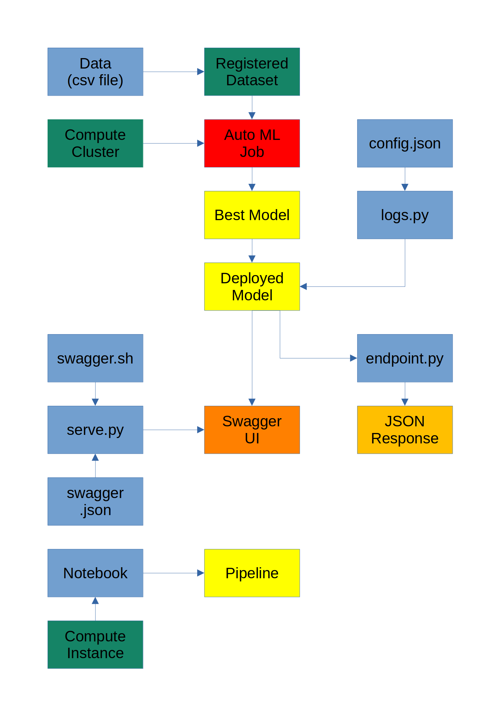

1. Data. Upload csv file and create a data asset in Azure ML
2. Compute. Create both a compute cluster, to train the model, and a compute instance, to run notebooks.
3. AutoML. We used AutoML to automatically train several models and pick the best one.
4. Deploy.
   - Using Swagger, we get a UI but run into problems
   - Using the `endpoint.py` script, we can consume the model ang receive JSON output
5. Pipeline. We create and publish a pipeline using a Jupyter notebook.

## Key Steps

We created the following resources, both on Azure and locally on Udacity's VM.

| Type               | Name                     | Observations    |
|--------------------|--------------------------|-----------------|
| Compute cluster    | edu-pro2-compute-cluster | Standard_DS3_v2 |
| Compute instance   | edu-pro2-compute-inst    | Standard_DS3_v2 |
| Tabular data asset | edu-pro2-data            |                 |
| Auto ML Job        | edu-pro2-exp             |                 |
| Deployed model     | edu-pro2-deploy          |                 |
| Python venv        | edu-pro2-venv            | Local (on VM)   |

- Create a data asset in Azure

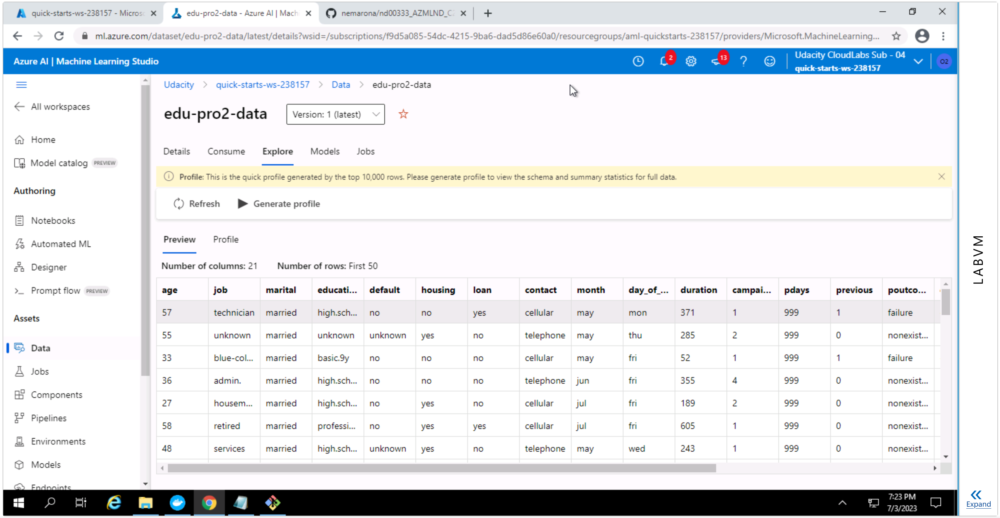

- Auto ML job is complete

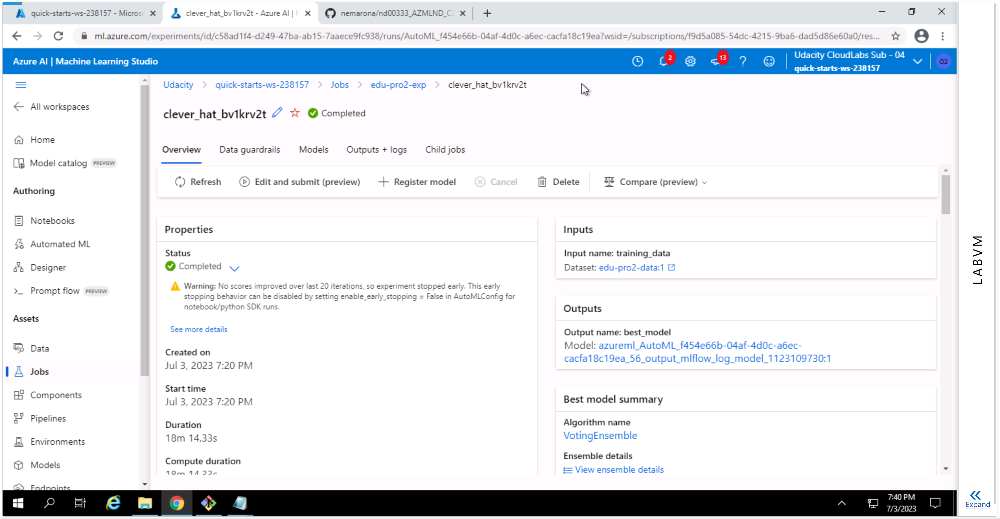

- Best model

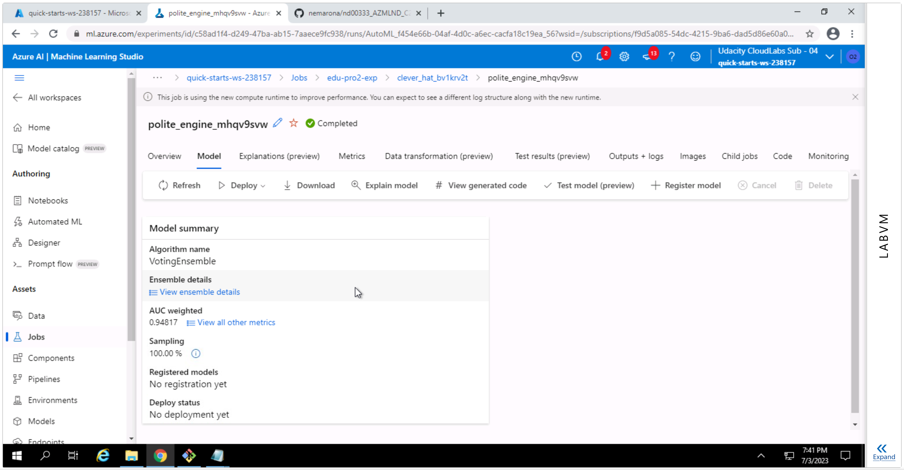

- Application insights enabled

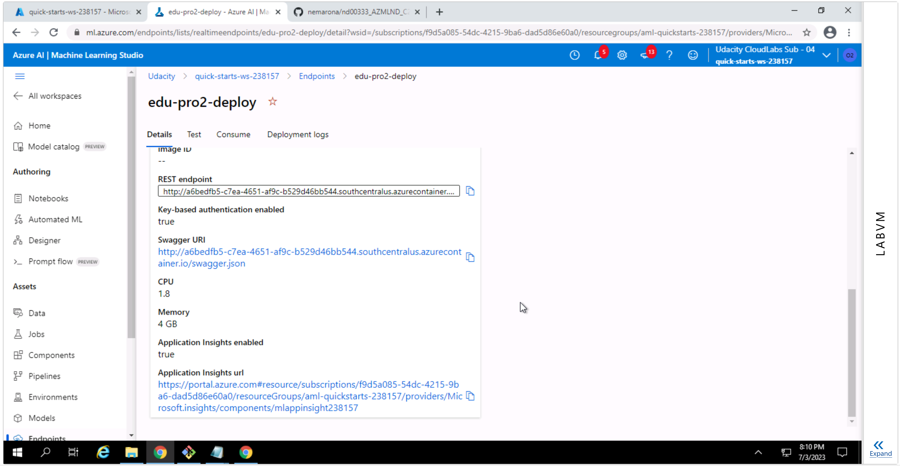

- Logs provided by `logs.py` script

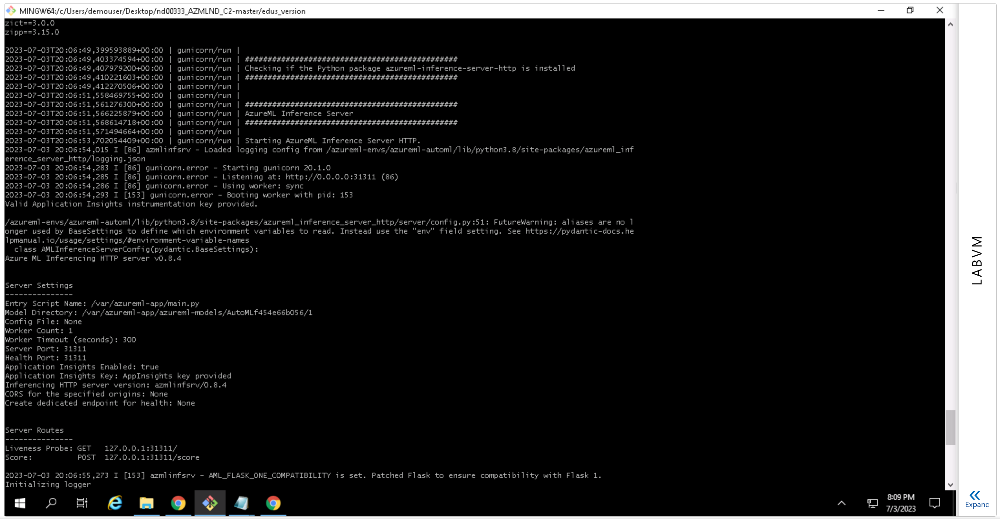

- Deployment in Swagger UI

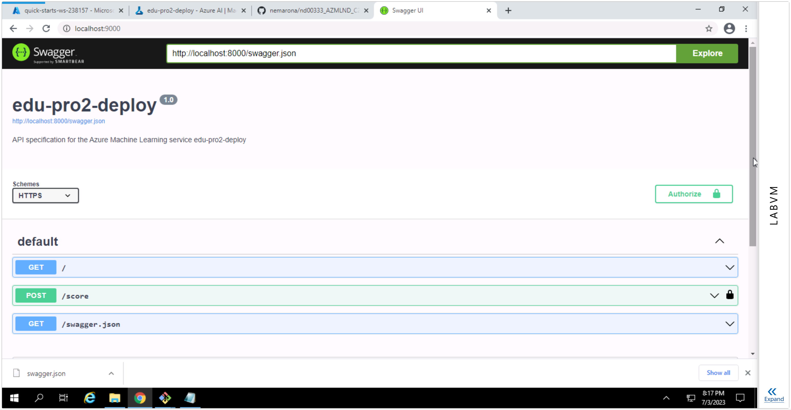

- Failed to fetch error

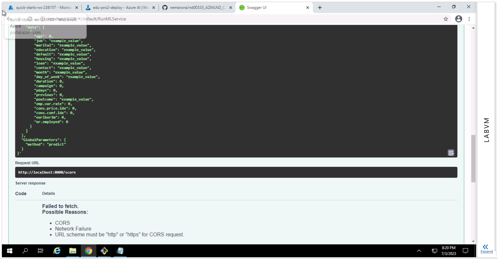

- Results from `endpoint.py` script

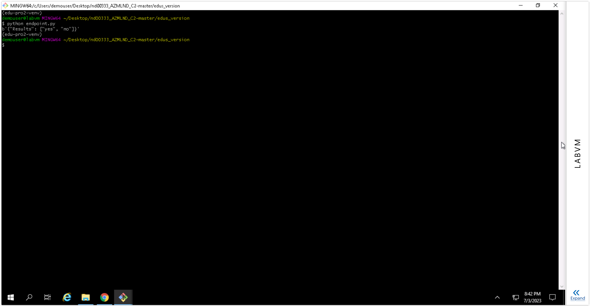

- Pipeline jobs

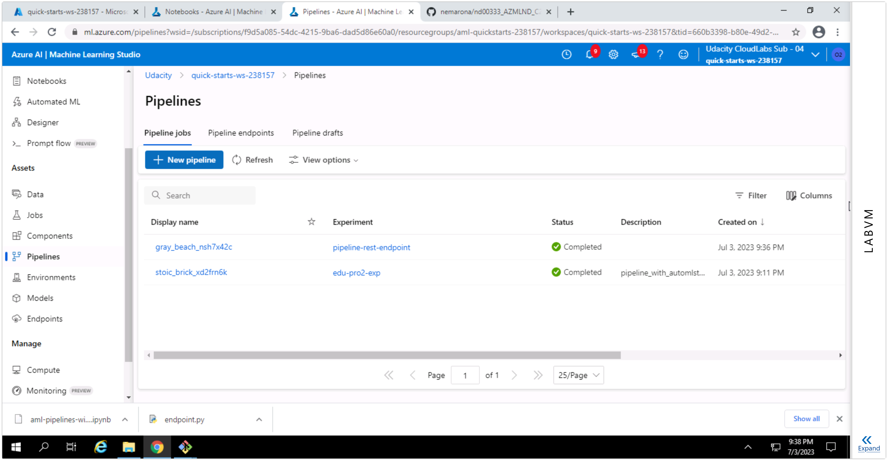

- Pipeline endpoints

- Published pipeline overview

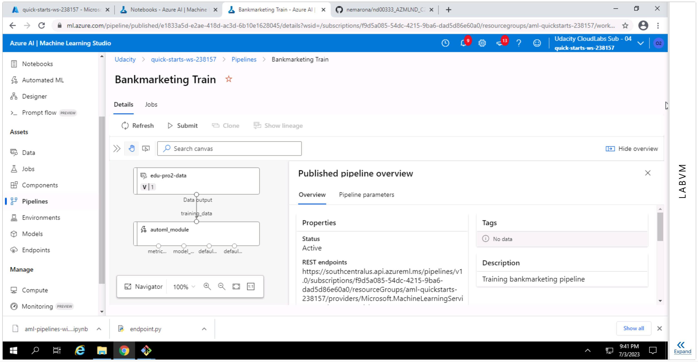

- `RunDetails` widget in notebook

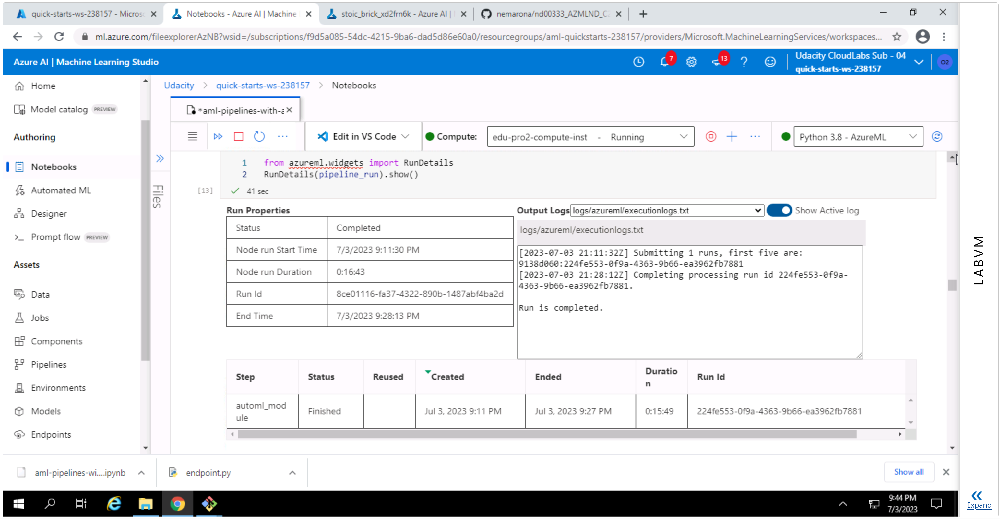

## Screen Recording

Screencast: https://youtu.be/o3wwtlRSz_c

## Standout Suggestions

Instead of relying on the `endpoint.py` file on the `starter_files` folder, which didn't work,
I adapted the script from the "Consume" tab of the deployed model.

Swagger UI wasn't able to provide output from the model, although I tried both HTTP and HTTPS modes.
